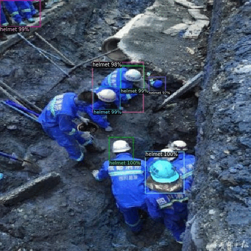

# Objects detection & segmentation
Решение задач детекции и сегментации изображений с использованием предобученных моделей
faster_rcnn_R_50_DC5 и mask_rcnn_R_50_DC5 с использованием библиотеки [detectron2](https://github.com/facebookresearch/detectron2).

Выше изображено обнаружение строительных касок на дообученной модели детекции. 

AP по каске и голове без каски - 34.3 и 41.3 соответственно.

В блокноте реализован как простой инференс с использованием предобученных моделей так и дообученные модели.
Простой инференс отлично работает на кофейных чашках:

При этом не определяет строительные каски рабочих:

